# AWS EKS Terraform Complete Architecture & Implementation Guide

## 📋 **Repository Overview**

This is a **production-grade, two-tier Terraform implementation** for provisioning AWS EKS infrastructure. It's organized into **separate projects** that maintain state independently and communicate via remote state:

1. **VPC Project** (01_VPC_terraform-manifests/) - Network infrastructure
2. **EKS Project** (02_EKS_terraform-manifests/) - Kubernetes control plane + worker nodes

---

## 🏗️ **High-Level Architecture** 


---

## 🌐 **Part 1: VPC Architecture & Implementation**

### **Key Components:**

1. **VPC** (10.0.0.0/16)
2. **3-AZ High Availability** - Subnets spread across 3 Availability Zones
3. **Public Subnets** - For NAT Gateway & future Load Balancers  
4. **Private Subnets** - For EKS nodes (secure, no direct internet)
5. **NAT Gateway** - Enables private subnet outbound traffic
6. **Internet Gateway** - Public internet access 

### **VPC Module Structure - Reusable Component**

```mermaid
graph LR
    subgraph VPC["VPC Module - Modular Design"]
        direction TB
        V["VPC Resource"]
        PUB["Public Subnets<br/>1 per AZ"]
        PRIV["Private Subnets<br/>1 per AZ"]
        IGW["Internet Gateway"]
        NAT["NAT Gateway"]
        PRT["Public Route Table<br/>→ IGW"]
        PRRT["Private Route Table<br/>→ NAT"]
    end
    
    INPUT["Input Variables<br/>• vpc_cidr<br/>• subnet_newbits<br/>• environment_name<br/>• tags"]
    
    OUTPUT["Outputs<br/>• vpc_id<br/>• public_subnet_ids<br/>• private_subnet_ids<br/>• public_subnet_map"]
    
    INPUT -->|Pass to Module| VPC
    VPC -->|Returns| OUTPUT
    
    LOGIC["Subnet Calculation<br/>cidrsubnet math<br/>using subnet_newbits"]
    
    LOGIC -->|Generates| PUB
    LOGIC -->|Generates| PRIV
    
    style VPC fill:#fff9c4
    style INPUT fill:#c8e6c9
    style OUTPUT fill:#c8e6c9
    style LOGIC fill:#ffe0b2
```



### **CIDR Subnet Calculation Mathematics**


### **Why This Design Choice?**
- **Modular**: VPC is a reusable module (`./modules/vpc/`) 
- **Dynamic**: Uses `for_each` loops - auto-scales based on AZs
- **HA (High Availability)**: 3 AZs ensure resilience
- **CIDR Math**: `cidrsubnet()` prevents overlap and waste
- **Separation**: Public/Private subnets with offset (k vs k+10)

### **VPC Module Code - main.tf**

```terraform
resource "aws_vpc" "main" {
  cidr_block           = var.vpc_cidr
  enable_dns_hostnames = true
  enable_dns_support   = true
  tags = merge(var.tags, { Name = "${var.environment_name}-vpc" })
  lifecycle {
    prevent_destroy = false
  }
}

resource "aws_internet_gateway" "igw" {
  vpc_id = aws_vpc.main.id
  tags = merge(var.tags, { Name = "${var.environment_name}-igw" })
}

resource "aws_subnet" "public" {
  for_each = { for idx, az in local.azs : az => local.public_subnets[idx] }
  vpc_id                  = aws_vpc.main.id
  cidr_block              = each.value
  availability_zone       = each.key
  map_public_ip_on_launch = true

  tags = merge(var.tags, {
    Name = "${var.environment_name}-public-${each.key}"
  })
}

resource "aws_subnet" "private" {
  for_each = { for idx, az in local.azs : az => local.private_subnets[idx] }
  vpc_id            = aws_vpc.main.id
  cidr_block        = each.value
  availability_zone = each.key
  tags = merge(var.tags, {
    Name = "${var.environment_name}-private-${each.key}"
  })
}

resource "aws_eip" "nat" {
  tags = merge(var.tags, { Name = "${var.environment_name}-nat-eip" })
}

resource "aws_nat_gateway" "nat" {
  allocation_id = aws_eip.nat.id
  subnet_id     = values(aws_subnet.public)[0].id
  tags = merge(var.tags, { Name = "${var.environment_name}-nat" })
  depends_on = [aws_internet_gateway.igw]
}

resource "aws_route_table" "public_rt" {
  vpc_id = aws_vpc.main.id
  route {
    cidr_block = "0.0.0.0/0"
    gateway_id = aws_internet_gateway.igw.id
  }
  tags = merge(var.tags, { Name = "${var.environment_name}-public-rt" })
}

resource "aws_route_table_association" "public_rt_assoc" {
  for_each = aws_subnet.public
  subnet_id      = each.value.id
  route_table_id = aws_route_table.public_rt.id
}

resource "aws_route_table" "private_rt" {
  vpc_id = aws_vpc.main.id
  route {
    cidr_block     = "0.0.0.0/0"
    nat_gateway_id = aws_nat_gateway.nat.id
  }
  tags = merge(var.tags, { Name = "${var.environment_name}-private-rt" })
}

resource "aws_route_table_association" "private_rt_assoc" {
  for_each = aws_subnet.private
  subnet_id      = each.value.id
  route_table_id = aws_route_table.private_rt.id
}
```

### **VPC Module - datasources-and-locals.tf**

```terraform
# Datasources
data "aws_availability_zones" "available" {
  state = "available"
}

# Locals Block
locals {
  azs             = slice(data.aws_availability_zones.available.names, 0, 3)
  public_subnets  = [for k, az in local.azs : cidrsubnet(var.vpc_cidr, var.subnet_newbits, k)]
  private_subnets = [for k, az in local.azs : cidrsubnet(var.vpc_cidr, var.subnet_newbits, k + 10)]
}
```

### **VPC Module - variables.tf**

```terraform
variable "environment_name" {
  description = "Environment name used in resource names and tags"
  type        = string
  default     = "dev"
}

variable "vpc_cidr" {
  description = "CIDR block for the VPC"
  type        = string
  default     = "10.0.0.0/16"
}

variable "tags" {
  description = "Global tags to apply to all resources"
  type        = map(string)
  default     = {
    Terraform = "true"
  }
}

variable "subnet_newbits" {
  description = "Number of new bits to add to VPC CIDR to generate subnets (e.g., 8 means /24 from /16)"
  type        = number
  default     = 8
}
```

### **VPC Module - outputs.tf**

```terraform
output "vpc_id" {
  value       = aws_vpc.main.id
  description = "The ID of the created VPC"
}

output "public_subnet_ids" {
  value       = [for s in aws_subnet.public : s.id]
  description = "List of public subnet IDs"
}

output "private_subnet_ids" {
  value       = [for s in aws_subnet.private : s.id]
  description = "List of private subnet IDs"
}

output "public_subnet_map" {
  value       = { for az, subnet in aws_subnet.public : az => subnet.id }
  description = "Map of AZ to Public Subnet ID"
}
```

### **VPC Project - c1-versions.tf**

```terraform
terraform {
  required_version = ">= 1.0.0"
  required_providers {
    aws = {
      source  = "hashicorp/aws"
      version = ">= 6.0"
    }
  }
# Remote Backend
  backend "s3" {
    bucket         = "tfstate-dev-us-east-1-jpjtof"
    key            = "vpc/dev/terraform.tfstate"
    region         = "us-east-1"
    encrypt        = true
    use_lockfile = true
  }   
}

provider "aws" {
  region = var.aws_region
}
```

### **VPC Project - c2-variables.tf**

```terraform
variable "aws_region" {
  description = "AWS region to deploy resources"
  type        = string
  default     = "us-east-1"
}

variable "environment_name" {
  description = "Environment name used in resource names and tags"
  type        = string
  default     = "dev"
}

variable "vpc_cidr" {
  description = "CIDR block for the VPC"
  type        = string
  default     = "10.0.0.0/16"
}

variable "tags" {
  description = "Global tags to apply to all resources"
  type        = map(string)
  default     = {
    Terraform = "true"
  }
}

variable "subnet_newbits" {
  description = "Number of new bits to add to VPC CIDR to generate subnets (e.g., 8 means /24 from /16)"
  type        = number
  default     = 8
}
```

### **VPC Project - c3-vpc.tf**

```terraform
module "vpc" {
  source = "./modules/vpc"
  environment_name = var.environment_name
  vpc_cidr         = var.vpc_cidr
  subnet_newbits   = var.subnet_newbits
  tags = var.tags
}
```

### **VPC Project - c4-outputs.tf**

```terraform
output "vpc_id" {
  value       = module.vpc.vpc_id
  description = "VPC ID used by EKS and other services"
}

output "private_subnet_ids" {
  value       = module.vpc.private_subnet_ids
  description = "Private subnets for EKS worker nodes"
}

output "public_subnet_ids" {
  value       = module.vpc.public_subnet_ids
  description = "Public subnets for ALB, NLB, etc."
}

output "public_subnet_map" {
  value       = module.vpc.public_subnet_map
  description = "Public subnets for ALB, NLB, etc."
}
```

---

## 🎯 **Part 2: EKS Cluster Architecture & Implementation**

### **Key Components:** 


---

## 🔐 **Part 3: IAM Roles & Permissions - The Trust Model** 

```mermaid
graph TB
    subgraph IAM_SETUP["IAM Trust & Permission Architecture"]
        direction TB
        
        subgraph CP_IAM["EKS Control Plane Role"]
            CPRole["Role: retail-dev-eks-cluster-role"]
            CPTrust["Trust Policy:<br/>Service Principal:<br/>eks.amazonaws.com<br/><br/>Allows EKS service<br/>to assume this role"]
            CPPolicies["Attached Policies:<br/>1. AmazonEKSClusterPolicy<br/>2. AmazonEKSVPCResourceController"]
            CPPerms["Permissions:<br/>• Manage VPC resources<br/>• Control ENI attachment<br/>• Read VPC settings<br/>• CloudWatch logs"]
        end
        
        subgraph NODE_IAM["EKS Node Group Role"]
            NGRole["Role: retail-dev-eks-nodegroup-role"]
            NGTrust["Trust Policy:<br/>Service Principal:<br/>ec2.amazonaws.com<br/><br/>Allows EC2 instances<br/>to assume this role"]
            NGPolicies["Attached Policies:<br/>1. AmazonEKSWorkerNodePolicy<br/>2. AmazonEKS_CNI_Policy<br/>3. AmazonEC2ContainerRegistryReadOnly"]
            NGPerms["Permissions:<br/>• Join EKS cluster<br/>• Manage ENIs/networking<br/>• Pull images from ECR<br/>• Report metrics"]
        end
        
        EKS_SVC["AWS EKS Service<br/>eks.amazonaws.com"]
        EC2_SVC["AWS EC2 Service<br/>ec2.amazonaws.com"]
        
        EKS_SVC -->|AssumeRole| CPRole
        CPRole -->|Grants| CPPerms
        EC2_SVC -->|AssumeRole| NGRole
        NGRole -->|Grants| NGPerms
    end
    
    style CPRole fill:#ffccbc
    style NGRole fill:#ffccbc
    style CPPerms fill:#ffab91
    style NGPerms fill:#ffab91
    style CPTrust fill:#ff7043
    style NGTrust fill:#ff7043
```



### **EKS Control Plane IAM Role - c6_eks_cluster_iamrole.tf**

```terraform
# IAM Role for EKS Control Plane
resource "aws_iam_role" "eks_cluster" {
  name = "${local.name}-eks-cluster-role"

  assume_role_policy = jsonencode({
    Version = "2012-10-17",
    Statement = [{
      Action    = "sts:AssumeRole",
      Effect    = "Allow",
      Principal = {
        Service = "eks.amazonaws.com"
      }
    }]
  })

  tags = var.tags
}

# Attach the required policy for EKS to manage cluster control plane
resource "aws_iam_role_policy_attachment" "eks_cluster_policy" {
  role       = aws_iam_role.eks_cluster.name
  policy_arn = "arn:aws:iam::aws:policy/AmazonEKSClusterPolicy"
}

# Attach VPC Resource Controller policy
resource "aws_iam_role_policy_attachment" "eks_vpc_resource_controller" {
  role       = aws_iam_role.eks_cluster.name
  policy_arn = "arn:aws:iam::aws:policy/AmazonEKSVPCResourceController"
}
```

### **EKS Node Group IAM Role - c8_eks_nodegroup_iamrole.tf**

```terraform
# IAM Role for EKS Managed Node Group (EC2 Worker Nodes)
resource "aws_iam_role" "eks_nodegroup_role" {
  name = "${local.name}-eks-nodegroup-role"

  assume_role_policy = jsonencode({
    Version = "2012-10-17",
    Statement = [{
      Action    = "sts:AssumeRole",
      Effect    = "Allow",
      Principal = {
        Service = "ec2.amazonaws.com"
      }
    }]
  })

  tags = var.tags
}

# IAM Policy Attachment: AmazonEKSWorkerNodePolicy
resource "aws_iam_role_policy_attachment" "eks_worker_node_policy" {
  role       = aws_iam_role.eks_nodegroup_role.name
  policy_arn = "arn:aws:iam::aws:policy/AmazonEKSWorkerNodePolicy"
}

# IAM Policy Attachment: AmazonEKS_CNI_Policy
resource "aws_iam_role_policy_attachment" "eks_cni_policy" {
  role       = aws_iam_role.eks_nodegroup_role.name
  policy_arn = "arn:aws:iam::aws:policy/AmazonEKS_CNI_Policy"
}

# IAM Policy Attachment: AmazonEC2ContainerRegistryReadOnly
resource "aws_iam_role_policy_attachment" "eks_ecr_policy" {
  role       = aws_iam_role.eks_nodegroup_role.name
  policy_arn = "arn:aws:iam::aws:policy/AmazonEC2ContainerRegistryReadOnly"
}
```

---

## 📦 **Part 4: Remote State Architecture - Cross-Project Communication** 

```mermaid
graph TB
    subgraph PROJECTS["Two Independent Terraform Projects"]
        subgraph VPC_PROJ["VPC Project<br/>01_VPC_terraform-manifests/"]
            VPC_TF["Terraform Code<br/>c1-versions.tf<br/>c2-variables.tf<br/>c3-vpc.tf<br/>c4-outputs.tf"]
            VPC_STATE["Local State<br/>terraform.tfstate"]
            VPC_S3["S3 Remote State<br/>Bucket: tfstate-dev-us-east-1<br/>Key: vpc/dev/terraform.tfstate"]
        end
        
        subgraph EKS_PROJ["EKS Project<br/>02_EKS_terraform-manifests/"]
            EKS_TF["Terraform Code<br/>c1_versions.tf<br/>c3_remote-state.tf<br/>c6_eks_cluster_iamrole.tf<br/>c7_eks_cluster.tf<br/>c9_eks_nodegroup_private.tf"]
            EKS_STATE["Local State<br/>terraform.tfstate"]
            EKS_S3["S3 Remote State<br/>Bucket: tfstate-dev-us-east-1<br/>Key: eks/dev/terraform.tfstate"]
        end
    end
    
    subgraph AWS_BACKEND["AWS Backend - Shared S3 Bucket"]
        S3["S3 Bucket<br/>tfstate-dev-us-east-1"]
        DDB["DynamoDB Table<br/>State Locking<br/>Prevents conflicts"]
        S3 <-->|Lock| DDB
    end
    
    VPC_TF -->|Writes| VPC_S3
    VPC_S3 -->|Stored in| S3
    
    EKS_TF -->|Writes| EKS_S3
    EKS_S3 -->|Stored in| S3
    
    EKS_TF -->|Reads via<br/>data.terraform_remote_state| VPC_S3
    
    VP_OUTPUT["VPC Outputs:<br/>• vpc_id<br/>• private_subnet_ids<br/>• public_subnet_ids<br/>• public_subnet_map"]
    
    VPC_S3 -->|Contains| VP_OUTPUT
    VP_OUTPUT -->|Used by<br/>EKS| EKS_TF
    
    style VPC_PROJ fill:#e1f5fe
    style EKS_PROJ fill:#f3e5f5
    style AWS_BACKEND fill:#fff3e0
    style S3 fill:#ffb74d
    style DDB fill:#ffb74d
```



### **EKS Project - c1_versions.tf**

```terraform
terraform {
  # Minimum Terraform CLI version required
  required_version = ">= 1.12.0"

  # Required providers and version constraints
  required_providers {
    aws = {
      source  = "hashicorp/aws"
      version = ">= 6.0"
    }
  }

  # Remote backend configuration using S3 
  backend "s3" {
    bucket         = "tfstate-dev-us-east-1-jpjtof"         
    key            = "eks/dev/terraform.tfstate"            
    region         = "us-east-1"                            
    encrypt        = true                                   
    use_lockfile   = true     
  }
}

provider "aws" {
  # AWS region to use for all resources (from variables)
  region = var.aws_region
}
```

### **EKS Project - c2_variables.tf**

```terraform
# --------------------------------------------------------
# AWS Region (used in provider block)
# --------------------------------------------------------
variable "aws_region" {
  description = "AWS region to deploy resources"
  type        = string
  default     = "us-east-1"
}

# --------------------------------------------------------
# Environment & Business Division Info
# --------------------------------------------------------
variable "environment_name" {
  description = "Environment name used in resource names and tags"
  type        = string
  default     = "dev"
}

variable "business_division" {
  description = "Business Division in the large organization this infrastructure belongs to"
  type        = string
  default     = "retail"
}

# --------------------------------------------------------
# EKS Cluster Configuration
# --------------------------------------------------------
variable "cluster_name" {
  description = "Name of the EKS cluster. Also used as a prefix in names of related resources."
  type        = string
  default     = "eksdemo"
}

variable "cluster_version" {
  description = "Kubernetes minor version to use for the EKS cluster (e.g. 1.28, 1.29)"
  type        = string
  default     = null
}

variable "cluster_service_ipv4_cidr" {
  description = "Service CIDR range for Kubernetes services. Optional — leave null to use AWS default."
  type        = string
  default     = null
}

variable "cluster_endpoint_private_access" {
  description = "Whether to enable private access to EKS control plane endpoint"
  type        = bool
  default     = false
}

variable "cluster_endpoint_public_access" {
  description = "Whether to enable public access to EKS control plane endpoint"
  type        = bool
  default     = true
}

variable "cluster_endpoint_public_access_cidrs" {
  description = "List of CIDR blocks allowed to access public EKS endpoint"
  type        = list(string)
  default     = ["0.0.0.0/0"]
}

# --------------------------------------------------------
# Common Tags
# --------------------------------------------------------
variable "tags" {
  description = "Tags to apply to EKS and related resources"
  type        = map(string)
  default     = {
    Terraform = "true"
  }
}

# --------------------------------------------------------
# EKS Node Group Configuration
# --------------------------------------------------------
variable "node_instance_types" {
  description = "List of EC2 instance types for the node group"
  type        = list(string)
  default     = ["t3.medium"]
}

variable "node_capacity_type" {
  description = "Instance capacity type: ON_DEMAND or SPOT"
  type        = string
  default     = "ON_DEMAND"
}

variable "node_disk_size" {
  description = "Disk size in GiB for worker nodes"
  type        = number
  default     = 20
}
```

### **EKS Project - c3_remote-state.tf**

```terraform
# Reference the Remote State from VPC Project
data "terraform_remote_state" "vpc" {
  backend = "s3"

  config = {
    bucket = "tfstate-dev-us-east-1-jpjtof"
    key    = "vpc/dev/terraform.tfstate"
    region = var.aws_region
  }
}

# Output the VPC ID from the remote VPC state
output "vpc_id" {
  value = data.terraform_remote_state.vpc.outputs.vpc_id
}

# Output the list of private subnets from the VPC
output "private_subnet_ids" {
  value = data.terraform_remote_state.vpc.outputs.private_subnet_ids
}

# Output the list of public subnets from the VPC
output "public_subnet_ids" {
  value = data.terraform_remote_state.vpc.outputs.public_subnet_ids
}
```

### **EKS Project - c4_datasources_and_locals.tf**

```terraform
# Local values used throughout the EKS configuration
locals {
  owners = var.business_division
  environment = var.environment_name
  name = "${local.owners}-${local.environment}"
  eks_cluster_name = "${local.name}-${var.cluster_name}"
}
```

### **EKS Project - c5_eks_tags.tf**

```terraform
# Public Subnet Tags for EKS Load Balancer Support
resource "aws_ec2_tag" "eks_subnet_tag_public_elb" {
  for_each    = toset(data.terraform_remote_state.vpc.outputs.public_subnet_ids)
  resource_id = each.value
  key         = "kubernetes.io/role/elb"
  value       = "1"
}

resource "aws_ec2_tag" "eks_subnet_tag_public_cluster" {
  for_each    = toset(data.terraform_remote_state.vpc.outputs.public_subnet_ids)
  resource_id = each.value
  key         = "kubernetes.io/cluster/${local.eks_cluster_name}"
  value       = "shared"
}

# Private Subnet Tags for EKS Internal LoadBalancer Support
resource "aws_ec2_tag" "eks_subnet_tag_private_elb" {
  for_each    = toset(data.terraform_remote_state.vpc.outputs.private_subnet_ids)
  resource_id = each.value
  key         = "kubernetes.io/role/internal-elb"
  value       = "1"
}

resource "aws_ec2_tag" "eks_subnet_tag_private_cluster" {
  for_each    = toset(data.terraform_remote_state.vpc.outputs.private_subnet_ids)
  resource_id = each.value
  key         = "kubernetes.io/cluster/${local.eks_cluster_name}"
  value       = "shared"
}
```

### **EKS Project - c7_eks_cluster.tf**

```terraform
# Create the AWS EKS Cluster
resource "aws_eks_cluster" "main" {
  name     = local.eks_cluster_name
  version  = var.cluster_version
  role_arn = aws_iam_role.eks_cluster.arn

  vpc_config {
    subnet_ids = data.terraform_remote_state.vpc.outputs.private_subnet_ids
    endpoint_private_access = var.cluster_endpoint_private_access
    endpoint_public_access  = var.cluster_endpoint_public_access
    public_access_cidrs     = var.cluster_endpoint_public_access_cidrs
  }

  kubernetes_network_config {
    service_ipv4_cidr = var.cluster_service_ipv4_cidr
  }

  enabled_cluster_log_types = [
    "api",
    "audit",
    "authenticator",
    "controllerManager",
    "scheduler"
  ]

  depends_on = [
    aws_iam_role_policy_attachment.eks_cluster_policy,
    aws_iam_role_policy_attachment.eks_vpc_resource_controller
  ]

  tags = var.tags

  access_config {
    authentication_mode = "API_AND_CONFIG_MAP"
    bootstrap_cluster_creator_admin_permissions = true
  }
}
```

### **EKS Project - c9_eks_nodegroup_private.tf**

```terraform
# EKS Managed Node Group - Private Subnets
resource "aws_eks_node_group" "private_nodes" {
  cluster_name = aws_eks_cluster.main.name
  node_group_name = "${local.name}-private-ng"
  node_role_arn = aws_iam_role.eks_nodegroup_role.arn
  subnet_ids = data.terraform_remote_state.vpc.outputs.private_subnet_ids
  instance_types = var.node_instance_types
  capacity_type = var.node_capacity_type
  ami_type = "AL2023_x86_64_STANDARD"
  disk_size = var.node_disk_size

  scaling_config {
    desired_size = 3
    min_size = 1
    max_size = 6
  }

  update_config {
    max_unavailable_percentage = 33
  }

  force_update_version = true

  labels = {
    "env"  = var.environment_name
    "team" = var.business_division
  }

  tags = merge(var.tags, {
    Name = "${local.name}-private-ng"
    Environment = var.environment_name
  })

  depends_on = [
    aws_iam_role_policy_attachment.eks_worker_node_policy,
    aws_iam_role_policy_attachment.eks_cni_policy,
    aws_iam_role_policy_attachment.eks_ecr_policy
  ]
}
```

### **EKS Project - c10_eks_outputs.tf**

```terraform
output "eks_cluster_endpoint" {
  value       = aws_eks_cluster.main.endpoint
  description = "EKS API server endpoint"
}

output "eks_cluster_id" {
  description = "The name/id of the EKS cluster."
  value       = aws_eks_cluster.main.id
}

output "eks_cluster_version" {
  description = "EKS Kubernetes version"
  value       = aws_eks_cluster.main.version
}

output "eks_cluster_name" {
  value       = aws_eks_cluster.main.name
  description = "EKS cluster name"
}

output "eks_cluster_certificate_authority_data" {
  value       = aws_eks_cluster.main.certificate_authority[0].data
  description = "Base64 encoded CA certificate for kubectl config"
}

output "private_node_group_name" {
  value       = aws_eks_node_group.private_nodes.node_group_name
  description = "Name of the EKS private node group"
}

output "eks_node_instance_role_arn" {
  value       = aws_iam_role.eks_nodegroup_role.arn
  description = "IAM Role ARN used by EKS node group (EC2 worker nodes)"
}

output "to_configure_kubectl" {
  description = "Command to update local kubeconfig to connect to the EKS cluster"
  value       = "aws eks --region ${var.aws_region} update-kubeconfig --name ${local.eks_cluster_name}"
}
```

### **terraform.tfvars**

```terraform
# AWS Region and Environment
aws_region = "us-east-1"
environment_name = "dev"
business_division = "retail"

# EKS Cluster 
cluster_name = "eksdemo1"
cluster_service_ipv4_cidr = "172.20.0.0/16"
cluster_version = "1.34"

# EKS Cluster Access Control
cluster_endpoint_private_access = false
cluster_endpoint_public_access = true
cluster_endpoint_public_access_cidrs = ["0.0.0.0/0"]

# EKS Node Group Configuration
node_instance_types = ["t3.small"]
node_capacity_type = "ON_DEMAND"
node_disk_size = 20
```

---

## 🔑 **Part 5: EKS Access Control - API Authentication**  


---

## ⚙️ **Part 6: Complete Implementation Steps**

### **Step 1: VPC Project Deployment**

```bash
# Navigate to VPC project
cd 01_VPC_terraform-manifests

# Initialize Terraform (downloads provider + backend setup)
terraform init

# Validate configuration syntax
terraform validate

# Plan changes (shows what will be created)
terraform plan

# Apply - creates VPC, subnets, NAT gateway, route tables
terraform apply -auto-approve
```

**What Creates:**
- VPC (10.0.0.0/16)
- 3 Public Subnets (one per AZ): 10.0.0.0/24, 10.0.1.0/24, 10.0.2.0/24
- 3 Private Subnets (one per AZ): 10.0.10.0/24, 10.0.11.0/24, 10.0.12.0/24
- 1 Internet Gateway
- 1 NAT Gateway (in public subnet)
- 2 Route Tables (public & private) + associations

**Key Files Role:**
- `c1-versions.tf` → Declares Terraform ≥1.0.0 & AWS provider ≥6.0
- `c2-variables.tf` → Input variables (region, VPC CIDR, tags)
- `c3-vpc.tf` → Calls VPC module with parameters
- `terraform.tfvars` → Actual values (region="us-east-1", VPC="10.0.0.0/16")

**Remote State Result:**
- Terraform state file saved to: `s3://tfstate-dev-us-east-1-jpjtof/vpc/dev/terraform.tfstate`
- VPC outputs (vpc_id, subnet_ids) available for EKS project to consume

---

### **Step 2: EKS Project Deployment**

```bash
# Navigate to EKS project (from root of 07_Terraform_EKS_Cluster)
cd 02_EKS_terraform-manifests

# Initialize Terraform
terraform init

# Validate configuration
terraform validate

# Plan (shows EKS cluster + node group creation)
terraform plan

# Apply - creates full EKS cluster (8-12 minutes)
terraform apply -auto-approve
```

**What Creates:**
1. **EKS Control Plane**
   - Kubernetes API server (multi-AZ replicas)
   - Control plane IAM role + policies
   - CloudWatch log groups for audit/api/scheduler logs
   
2. **EKS Node Group**
   - Managed Auto Scaling Group (3 nodes, min=1, max=6)
   - EC2 instances (t3.small) running Amazon Linux 2023
   - Node IAM role + policies (EKS worker + CNI + ECR read)
   - Auto scaling configuration

3. **Networking Integration**
   - Control plane ENIs in private subnets
   - Public/Private endpoint access configuration
   - Subnet tags for ALB compatibility
   - Security group associations

**Key Files Role:**
- `c1_versions.tf` → Terraform/provider versions & S3 backend config
- `c2_variables.tf` → Cluster config (name, version, node types, access settings)
- `c3_remote-state.tf` → Reads VPC state from S3, imports vpc_id + subnet_ids
- `c4_datasources_and_locals.tf` → Build naming convention locally
- `c5_eks_tags.tf` → Add Kubernetes-aware tags to subnets
- `c6_eks_cluster_iamrole.tf` → Control plane IAM role + policies
- `c7_eks_cluster.tf` → Main EKS cluster resource
- `c8_eks_nodegroup_iamrole.tf` → Worker node IAM role + policies
- `c9_eks_nodegroup_private.tf` → EKS Managed Node Group
- `c10_eks_outputs.tf` → Export cluster endpoint, name, CA cert, kubeconfig command

---

### **Step 3: Configure kubectl Access**  


```bash
# Terraform will output the command. Run it:
aws eks update-kubeconfig --name retail-dev-eksdemo1 --region us-east-1

# Verify connection
kubectl get nodes
# Output:
# NAME                                                STATUS   ROLES    AGE
# ip-10-0-10-xxx.ec2.internal                         Ready    <none>   2m
# ip-10-0-11-xxx.ec2.internal                         Ready    <none>   2m
# ip-10-0-12-xxx.ec2.internal                         Ready    <none>   2m

# Check system pods
kubectl get pods -n kube-system
# Shows CoreDNS, kube-proxy, VPC-CNI daemonsets
```

---

## 🧠 **Part 7: Core Logic Explanations**

### **VPC Module Design Logic**

**Why Modular?**
```terraform
# VPC is a MODULE (in ./modules/vpc/)
source = "./modules/vpc"

# Reasons:
# 1. Reusability - use in multiple projects
# 2. Encapsulation - VPC details hidden
# 3. Clarity - c3-vpc.tf is simple & readable
# 4. Testability - can test module independently
```

**CIDR Subnet Math Explained:**

```python
# Input:
vpc_cidr = "10.0.0.0/16"      # 65,536 IPs
subnet_newbits = 8             # Add 8 bits to /16 = /24

# Calculation (for_each loop):
for k in range(3):             # 3 AZs
    public_subnet = cidrsubnet("10.0.0.0/16", 8, k)
    # k=0: 10.0.0.0/24     (256 IPs)
    # k=1: 10.0.1.0/24     (256 IPs)
    # k=2: 10.0.2.0/24     (256 IPs)

    private_subnet = cidrsubnet("10.0.0.0/16", 8, k+10)
    # k+10=10: 10.0.10.0/24   (256 IPs)
    # k+10=11: 10.0.11.0/24   (256 IPs)
    # k+10=12: 10.0.12.0/24   (256 IPs)

# Why k+10 offset?
# Prevents collision: public uses 0-2, private uses 10-12
# Leaves room: indices 3-9 available for expansion
```

### **EKS Access Configuration Logic**

```terraform
access_config {
    # "API_AND_CONFIG_MAP" = support both old & new methods
    # This means:
    # 1. aws-auth ConfigMap still works (for backwards compatibility)
    # 2. Access Entries API works (for future AWS direction)
    # 3. If you're using Terraform, both get synced automatically
    
    authentication_mode = "API_AND_CONFIG_MAP"
    
    # bootstrap_cluster_creator_admin_permissions = true
    # Before: Only nobody had access to new cluster
    # After: IAM user who ran 'terraform apply' gets cluster-admin
    # This is critical - otherwise you'd be locked out!
    bootstrap_cluster_creator_admin_permissions = true
}
```

### **Node Group Scaling Configuration**

```terraform
scaling_config {
    desired_size = 3    # Start with 3 nodes
    min_size = 1        # Never scale below 1 (cost savings)
    max_size = 6        # Don't exceed 6 (cost control)
}

update_config {
    max_unavailable_percentage = 33  # 33% of nodes can be replaced at once
    # Math: 3 nodes × 33% = 1 node max unavailable
    # Ensures: Always 2 nodes running during updates (HA)
}

force_update_version = true  # Auto update when AMI changes
```

---

## 🔄 **Remote State Data Flow**

### **How EKS Accesses VPC Data:**

```terraform
# In c3_remote-state.tf:
data "terraform_remote_state" "vpc" {
  backend = "s3"
  config = {
    bucket = "tfstate-dev-us-east-1-jpjtof"
    key    = "vpc/dev/terraform.tfstate"
    region = var.aws_region
  }
}

# Now EKS can use:
data.terraform_remote_state.vpc.outputs.vpc_id
data.terraform_remote_state.vpc.outputs.private_subnet_ids
data.terraform_remote_state.vpc.outputs.public_subnet_ids

# In c7_eks_cluster.tf:
vpc_config {
  subnet_ids = data.terraform_remote_state.vpc.outputs.private_subnet_ids
  # ^^^ This reads from VPC state automatically!
}
```

**Why This Approach?**
- ✅ **Decoupling**: VPC and EKS can be destroyed/recreated independently
- ✅ **Reusability**: Multiple EKS clusters can share one VPC
- ✅ **State Isolation**: State files in separate S3 keys prevent conflicts
- ✅ **Collaboration**: Teams can work on VPC and EKS simultaneously
- ✅ **Version Control**: Infrastructure code can be in same repo, state cannot

---

## 💾 **State Locking & DynamoDB**

```terraform
# In both c1_versions.tf files:
backend "s3" {
    bucket = "tfstate-dev-us-east-1-jpjtof"
    key    = "vpc/dev/terraform.tfstate"  # OR "eks/dev/terraform.tfstate"
    encrypt = true
    use_lockfile = true  # ← Enable DynamoDB locking
}

# What happens:
# 1. terraform init → Creates S3 bucket + DynamoDB table
# 2. terraform plan → Acquires lock in DynamoDB (prevents other runs)
# 3. terraform apply → Holds lock until complete
# 4. terraform release lock → Others can now run

# Why?
# Without locking: Two people run terraform apply simultaneously
#   → Conflict → Corrupted state → Data loss!
# With locking: Second person waits for first to complete
#   → Safe concurrent access
```

---

## 🏭 **Implementation Best Practices Demonstrated**

| Best Practice | How Implemented |
|---|---|
| **High Availability** | 3 AZs, multi-AZ node distribution, ASG ≥ 1 |
| **Security** | Private subnets for nodes, NAT gateway, IAM policies, CloudWatch logs |
| **Modularity** | VPC is reusable module, separated VPC/EKS projects |
| **Scalability** | Auto Scaling Group with min/max, dynamic CIDR calculation, for_each loops |
| **Naming Convention** | Standardized: `${business_division}-${environment}-${resource_type}` |
| **State Management** | Remote S3 backend, DynamoDB locking, cross-project references |
| **Cost Control** | ON_DEMAND instance option, node scaling limits, small instance types |
| **Observability** | EKS control plane logs, CloudWatch integration, tagging strategy |
| **Encryption** | S3 backend encryption, etcd encrypted, TLS for API |
| **Tagging Strategy** | Kubernetes-aware tags (elb role, cluster discovery), global tags |

---

## 📊 **File Dependency Graph** 


---

## 🚀 **Complete Step-by-Step Implementation Guide**

### **Pre-Requisites:**
```bash
# Install required tools
aws cli version 2           # AWS credentials configured
terraform >= 1.12.0       # Infrastructure as Code tool
kubectl                    # Kubernetes CLI
aws-iam-authenticator     # Built into AWS CLI v2
```

### **Execution Sequence:**

```bash
# ============================================
# STEP 1: Deploy VPC Infrastructure
# ============================================
cd 01_VPC_terraform-manifests

# 1a. Review current configuration
cat terraform.tfvars  # Check region, VPC CIDR, environment
cat c2-variables.tf   # See default values

# 1b. Initialize Terraform workspace
terraform init
# Creates: .terraform/, .terraform.lock.hcl

# 1c. Validate syntax
terraform validate

# 1d. Plan changes (preview)
terraform plan
# Shows: 1 VPC, 3 public subnets, 3 private subnets, 
#        IGW, NAT gateway, route tables, etc.

# 1e. Apply configuration
terraform apply -auto-approve
# Takes: ~3-5 minutes
# Output: vpc_id, subnet_ids, nat_gateway_ip, etc.

# 1f. Verify state was saved
aws s3 ls s3://tfstate-dev-us-east-1-jpjtof/vpc/dev/
# Should show: terraform.tfstate

# ============================================
# STEP 2: Deploy EKS Cluster
# ============================================
cd ../02_EKS_terraform-manifests

# 2a. Review EKS configuration
cat terraform.tfvars
# Key settings:
# - cluster_name = "eksdemo1"
# - cluster_version = "1.34"
# - node_instance_types = ["t3.small"]
# - node_capacity_type = "ON_DEMAND"

# 2b. Initialize (reads remote VPC state)
terraform init
# Important: Configures S3 backend (different key than VPC)

# 2c. Validate
terraform validate

# 2d. Plan
terraform plan
# Shows: EKS cluster, node group, IAM roles, security groups,
#        will pull subnet_ids from VPC state automatically

# 2e. Apply (creates EKS cluster)
terraform apply -auto-approve
# Takes: ~8-12 minutes
# Watch: AWS Console → EKS → Clusters → Status

# 2f. Capture outputs
terraform output eks_cluster_name        # eksdemo1
terraform output eks_cluster_endpoint    # https://...
terraform output eks_cluster_id          # retail-dev-eksdemo1
terraform output to_configure_kubectl    # Command needed next

# ============================================
# STEP 3: Configure kubectl Access
# ============================================

# 3a. Copy the kubeconfig command from output
aws eks update-kubeconfig \
  --name retail-dev-eksdemo1 \
  --region us-east-1

# 3b. Verify connection
kubectl cluster-info
# Should show: Kubernetes control plane is running

# 3c. Check nodes
kubectl get nodes
# Output:
# NAME                            STATUS   ROLES
# ip-10-0-10-xxx.ec2.internal     Ready    <none>
# ip-10-0-11-xxx.ec2.internal     Ready    <none>
# ip-10-0-12-xxx.ec2.internal     Ready    <none>

# 3d. Check system pods
kubectl get pods -n kube-system
# Should show: coredns, kube-proxy, aws-node (VPC-CNI)

# ============================================
# STEP 4: Verify Full Cluster Health
# ============================================

# 4a. Test API access
kubectl auth can-i create pods --as system:serviceaccount:default:default
# false (expected - no default permissions)

# 4b. Deploy test pod
kubectl run nginx --image=nginx
kubectl get pods
kubectl logs nginx
kubectl delete pod nginx

# 4c. Access AWS Console
# Go to: AWS Console → EKS → Clusters → retail-dev-eksdemo1
# Check:
#   - Overview tab: Cluster info, endpoint URL
#   - Resources tab: Nodes, VPC, subnets
#   - Compute tab: Node group status
#   - Add-ons tab: Default addons (VPC-CNI, kube-proxy, coredns)
```

---

## 🎛️ **Customization Points** 

If you want to modify the infrastructure:

### **Change Cluster Name:**
```terraform
# In terraform.tfvars:
cluster_name = "my-custom-cluster"  # Instead of "eksdemo1"

# Result:
# Cluster will be named: retail-dev-my-custom-cluster
```

### **Change Node Instance Type:**
```terraform
# In terraform.tfvars:
node_instance_types = ["t3.medium"]  # Or: m5.large, c5.xlarge

# Trade-off:
# t3.small: Cheap, good for dev ($0.02/hr)
# t3.medium: More CPU/RAM ($0.04/hr)
# m5.large: Production ($0.096/hr)
```

### **Scale Nodes:**
```terraform
# In c9_eks_nodegroup_private.tf:
scaling_config {
    desired_size = 5      # Start with 5 instead of 3
    min_size = 2          # Minimum 2 for HA
    max_size = 10         # Max 10 for cost control
}
```

### **Use SPOT Instances (Cost: -70%):**
```terraform
# In terraform.tfvars:
node_capacity_type = "SPOT"  # Instead of ON_DEMAND

# Benefit: 70% cheaper
# Risk: Can be interrupted with 2-min notice
# Good for: Dev/test, fault-tolerant workloads
```

### **Change VPC CIDR:**
```terraform
# In 01_VPC_terraform-manifests/terraform.tfvars:
vpc_cidr = "172.16.0.0/16"  # 65,536 IPs instead of 10.0.0.0/16

# Result:
# Public subnets: 172.16.0.0/24, 172.16.1.0/24, 172.16.2.0/24
# Private subnets: 172.16.10.0/24, 172.16.11.0/24, 172.16.12.0/24
```

### **Add More Subnets (5 AZs instead of 3):**
```terraform
# In modules/vpc/datasources-and-locals.tf:
locals {
  azs = slice(data.aws_availability_zones.available.names, 0, 5)
  # ^^^ Change from 3 to 5
  # Now creates: 5 public + 5 private subnets!
}
```

---

## 🧹 **Cleanup (Destroy Infrastructure)**

```bash
# Important: Destroy in REVERSE order (EKS first, then VPC)

# ============================================
# STEP 1: Destroy EKS Cluster
# ============================================
cd 02_EKS_terraform-manifests
terraform destroy -auto-approve
# Takes: ~8-10 minutes
# Destroys: EKS cluster, nodes, IAM roles, tags, etc.

# ============================================
# STEP 2: Destroy VPC
# ============================================
cd ../01_VPC_terraform-manifests
terraform destroy -auto-approve
# Takes: ~2-3 minutes
# Destroys: VPC, subnets, NAT gateway, IGW, route tables

# ============================================
# STEP 3: Clean up S3 state files (optional)
# ============================================
aws s3 rm s3://tfstate-dev-us-east-1-jpjtof/vpc/dev/terraform.tfstate
aws s3 rm s3://tfstate-dev-us-east-1-jpjtof/eks/dev/terraform.tfstate
# Only do this if you're confident you won't need rollback
```

---

## 📝 **Summary Table**

| Component | Location | Purpose | Lifecycle |
|---|---|---|---|
| **VPC Module** | `modules/vpc/` | Reusable network infrastructure | Created once, referenced everywhere |
| **VPC Project** | `01_VPC_terraform-manifests/` | Standalone VPC deployment | Deploy before EKS |
| **EKS Project** | `02_EKS_terraform-manifests/` | Kubernetes control plane + nodes | Deploy after VPC |
| **Remote State** | S3 `tfstate-dev-us-east-1` | Shared state backend | Both projects use it |
| **EKS Control Plane** | AWS Managed | Kubernetes API, scheduler, etcd | Automatically HA across AZs |
| **Node Group** | EC2 ASG in Private Subnets | Kubernetes worker nodes | Scales 1-6 nodes automatically |
| **IAM Roles** | Both projects | Trust & permissions model | 2 roles: control plane + nodes |

---

## 🎓 **Key Learning Takeaways**

1. **Modular Design** - VPC as a module enables reusability across multiple projects
2. **Remote State** - Terraform's `data.terraform_remote_state` enables cross-project communication without coupling
3. **CIDR Mathematics** - `cidrsubnet()` function enables dynamic subnet calculation with proper offset (k vs k+10)
4. **IAM Trust Model** - Service principals (eks.amazonaws.com, ec2.amazonaws.com) enable trust delegation
5. **HA Design** - 3 AZs + Auto Scaling Group ensures resilience to AZ failures
6. **Separation of Concerns** - VPC and EKS projects can be managed, versioned, and destroyed independently
7. **Access Control** - `API_AND_CONFIG_MAP` authentication mode provides compatibility while being future-proof
8. **State Locking** - DynamoDB prevents concurrent modifications, ensuring consistency

---

## 📚 **Additional Resources**

- [Terraform AWS Documentation](https://registry.terraform.io/providers/hashicorp/aws/latest/docs)
- [AWS EKS Best Practices Guide](https://aws.github.io/aws-eks-best-practices/)
- [Kubernetes Official Documentation](https://kubernetes.io/docs/)
- [Terraform Best Practices](https://www.terraform.io/docs/language/values/locals)

---

**This architecture is production-ready, scalable, modular, and follows AWS best practices!** 🚀
